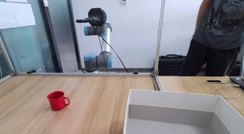
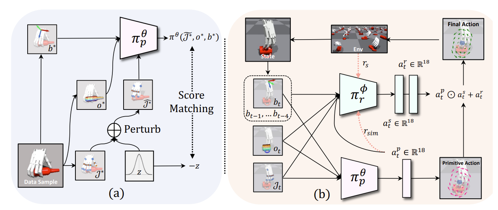

# Learning Score-based Grasping Primitive for Human-assisting Dexterous Grasping

[](https://sites.google.com/view/graspgf)
[](https://arxiv.org/abs/2309.06038)
[](https://hits.seeyoufarm.com)
[](https://github.com/Jiyao06/GenPose/blob/main/LICENSE)

This repo is the official implementation of NeurIPS 2023 paper, [GraspGF](https://arxiv.org/abs/2309.06038).

## TODOs (Under Development):
- [x] README
- [x] Testing
- [x] Training
- [ ] Refine and Vis

## Overview
 

In this paper, we propose a novel task called **human-assisting dexterous grasping** that aims to train a policy for controlling a robotic hand's fingers to assist users in grasping diverse objects with diverse grasping poses.

 

We address this challenge by proposing an approach consisting of **two sub-modules**: a hand-object-conditional grasping primitive called Grasping Gradient Field (**GraspGF**), and a history-conditional **residual policy**. 

Contents of this repo are as follows:

- [Installation](#installation)
  - [Requirements](#requirements)
- [Dataset](#dataset)
  - [Asset](#asset)
  - [ExpertDataset](#expert-dataset)
- [Training](#training)
  - [GraspGF](#training-the-graspgf)
  - [Pointnet Pretrain](#pretrain-the-pointnet-for-rl)
  - [RL+GraspGF](#training-the-rl-with-graspgf)
- [Evaluation](#evaluation)
- [Acknowledgement](#acknowledgement)
- [Citation](#citation)
- [Contact](#contact)
- [License](#license)


## Installation

### Requirements
The code has been tested on Ubuntu 20.04 with Python 3.8. 

### Install

**IsaacGym**:

You can refer installation of IsaacGym [here](https://developer.nvidia.com/isaac-gym). We currently support the Preview Release 4 version of IsaacGym.


**Human-assisting Dexterous Grasping Environment**:
```
cd ConDexEnv
pip install -e .
```

**Pointnet2**:
```
cd Networks/pointnet2
pip install -e .
```

**Other Dependencies**

python package:
``` 
ipdb
tqdm
opencv-python
matplotlib
transforms3d
open3d
```

## Dataset

### Asset
you can download filterd mesh and origin grasp pose dataset from [Human-assisting Dexterous Grasping/Asset](https://drive.google.com/drive/folders/1fUKlUu1ifYQJ5_7NkmC1jpkEysLR9v8A) and put on following directopry.
```
ConDexEnv/assets
```
There are three sets in our dataset: train, seencategory and unseencategory. You can choose to only download one of them for simple demonstration.
### ExpertDataset
you can download filterd grasping dataset, human trajectories, and pointcloud buffer from [Human-assisting Dexterous Grasping/ExpertDatasets](https://drive.google.com/drive/folders/1JjxaMlao4IrGUO-v8l9FsXd_Vp3t-jzr) and put on current directory.

There are three types of data: 
1. Human trajectories: sampled from [Handover-Sim](https://github.com/NVlabs/handover-sim), which has to be downloaded.
```
ExpertDatasets/human_traj_200_all.npy
```
2. Pointcloud Buffer: contains pointcloud of objects we are using, you can download according to object dataset you download in asset.
```
ExpertDatasets/pcl_buffer_4096_train.pkl
ExpertDatasets/pcl_buffer_4096_seencategory.pkl
ExpertDatasets/pcl_buffer_4096_unseencategory.pkl
```
3. Human Grasp Pose: contains human grasp pose which can also be downloaded according to object dataset you download in asset.
```
ExpertDatasets/grasp_data/ground/*_oti.pth
ExpertDatasets/grasp_data/ground/*_rc_ot.pth
ExpertDatasets/grasp_data/ground/*_rc.pth
```


## Training 

### Training the GraspGF
For training GraspGF with pointnet2, fill following arguments in shell "gf_train.sh"
```
python ./Runners/TrainSDE_update.py \
--log_dir gf_pt2 \
--sde_mode vp \
--batch_size 3027 \
--lr 2e-4 \
--t0 0.5 \
--train_model \
--demo_nums 15387 \
--num_envs=3027 \
--demo_name=train_gf_rc \
--eval_demo_name=train_eval \
--device_id=0 \
--mode train \
--dataset_type train \
--relative \
--space riemann \
--pt_version pt2 \
```
Then run
```
sh ./gf_train.sh
```

### Pretrain the pointnet for RL
fill following arguments in shell "gf_train.sh"
```
python ./Runners/TrainSDE_update.py \
--log_dir gf_pt \
--sde_mode vp \
--batch_size 3077 \
--lr 2e-4 \
--t0 0.5 \
--train_model \
--demo_nums 15387 \
--num_envs=3027 \
--demo_name=train_gf_rc \
--eval_demo_name=train_eval \
--device_id=0 \
--mode train \
--dataset_type train \
--relative \
--space riemann \
--pt_version pt \
```
Then run
```
sh ./gf_train.sh
```

### Training the RL with GraspGF
```
sh ./rl_train.sh
```


## Evaluation
```
sh ./rl_eval.sh
```
you can download pretrained checkpoint from [Human-assisting Dexterous Grasping/Ckpt](https://drive.google.com/drive/folders/17nWw5PZKNdpAPdlUKzHWY4aKWK4L8vus?usp=drive_link), and put on current directory for evluating pretrained model by adding following in rl_eval.sh.
```
--score_model_path="Ckpt/gf" \
--model_dir="Ckpt/gfppo.pt" \
```

## Acknowledgement
The code and dataset used in this project is built from these repository:

Environment: 

[NVIDIA-Omniverse/IsaacGymEnvs](https://github.com/NVIDIA-Omniverse/IsaacGymEnvs)

[PKU-MARL/DexterousHands](https://github.com/PKU-MARL/DexterousHands)

Dataset: 

[PKU-EPIC/DexGraspNet](https://github.com/PKU-EPIC/DexGraspNet)

[PKU-EPIC/UniDexGrasp](https://github.com/PKU-EPIC/UniDexGrasp)

[NVlabs/handover-sim](https://github.com/NVlabs/handover-sim)

Diffusion:

[yang-song/score_sde_pytorch](https://github.com/yang-song/score_sde_pytorch)

[AaronAnima/TarGF](https://github.com/AaronAnima/TarGF)

Pointnet:

[hwjiang1510/GraspTTA](https://github.com/hwjiang1510/GraspTTA/tree/master)

Pointnet2:

[ck-kai/SGPA](https://github.com/ck-kai/SGPA)

## Citation
If you find our work useful in your research, please consider citing:
``` bash
@article{wu2023learning,
  title={Learning Score-based Grasping Primitive for Human-assisting Dexterous Grasping},
  author={Tianhao Wu and Mingdong Wu and Jiyao Zhang and Yunchong Gan and Hao Dong},
  booktitle={Thirty-seventh Conference on Neural Information Processing Systems},
  year={2023},
  url={https://openreview.net/forum?id=fwvfxDbUFw}
}
```

## Contact
If you have any suggestion or questions, please feel free to contact us:

[Tianhao Wu](https://tianhaowuhz.github.io/): [thwu@stu.pku.edu.cn](mailto:thwu@stu.pku.edu.cn)

[Mingdong Wu](https://aaronanima.github.io/): [wmingd@pku.edu.cn](mailto:wmingd@pku.edu.cn)

[Hao Dong](https://zsdonghao.github.io/): [hao.dong@pku.edu.cn](mailto:hao.dong@pku.edu.cn)

## License
This project is released under the MIT license. See [LICENSE](LICENSE) for additional details.


